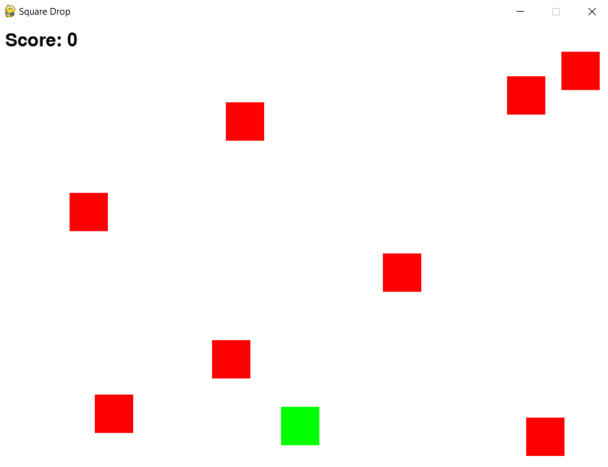

# Square Drop Game

Square Drop is a simple game developed using Python's Pygame library, where the player controls a green square to avoid red enemy squares. The game aims to survive as long as possible without colliding with the enemy squares. The score increases continuously when the player successfully avoids collisions. Once the player collides with any enemy square, the game ends.

## Instructions

- Move the green square using the left and right arrow keys to avoid colliding with the falling red enemy squares.
- The score increases as long as the green square does not collide with the enemy squares.
- If the green square collides with any enemy square, the game ends.

## How to Run

1. Ensure you have Python installed.
2. Install the Pygame library: `pip install pygame`
3. Run the game: `python square_drop.py`

## Gameplay

## Controls

- Use the `left arrow key` to move the green square to the left.
- Use the `right arrow key` to move the green square to the right.

## Notes

This is a basic game to practice collision detection and game development using Pygame. Any feedback or improvements are welcome!

Developed by jmgalin

